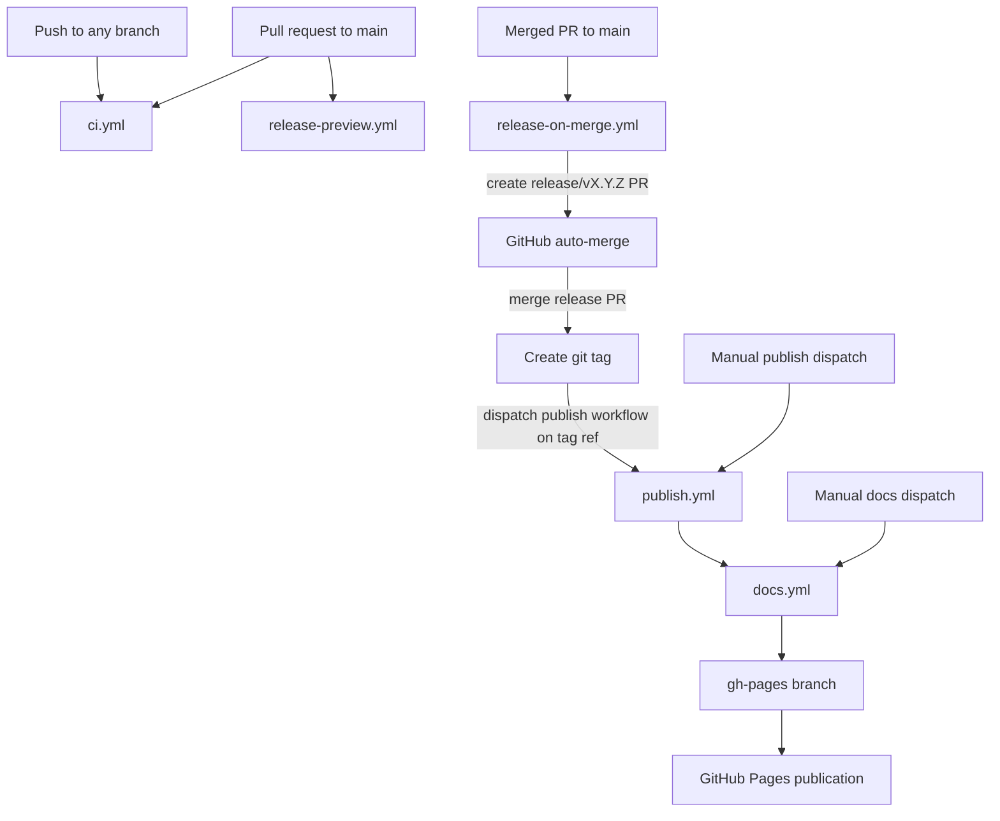

# GitHub Workflows

This repository uses a release-first CI/CD flow with `publish` as the orchestration point for release-side automation.

Workflow roles:

- `ci.yml`: Runs tests, quality checks, and docs build validation on every push and on pull requests to `main`.
- `release-preview.yml`: Shows the next semantic version implied by the PR labels.
- `release-on-merge.yml`: Creates the version-bump release PR after a normal PR merge, enables auto-merge for that release PR, and tags/releases when the release PR merges. After tagging a release, it dispatches `publish.yml` as a fresh workflow run on the release tag.
- `publish.yml`: Publishes the package to PyPI from a direct `workflow_dispatch` run and then triggers documentation deployment after both release-driven and manual publishes.
- `docs.yml`: Builds the documentation and publishes it to the `gh-pages` branch, either manually or when called by `publish.yml`.

Workflow status table:

| Workflow | Primary trigger | Required check for PRs to `main` | Callable/manual only | Notes |
| --- | --- | --- | --- | --- |
| `ci.yml` | `push`, `pull_request` | Yes | No | Produces the required PR checks `CI / test (3.14)`, `CI / quality`, and `CI / docs`. |
| `release-preview.yml` | `pull_request` | No | No | Informational semantic-version preview. Make it required only if you want label validation enforced at merge time. |
| `release-on-merge.yml` | `pull_request_target` on closed PRs | No | No | Post-merge automation only; not a branch protection check. It tags the merged release PR and then dispatches `publish.yml` on the new tag. |
| `publish.yml` | `workflow_dispatch` | No | Yes | Dispatched automatically after a release tag is created, or run manually for a controlled main-branch publish; in both cases it proceeds to docs deployment after a successful package publish. |
| `docs.yml` | `workflow_call`, `workflow_dispatch` | No | Yes | Called by `publish.yml` after package publication, or run manually to republish docs. |

Expected repository setting:

- GitHub Pages should be configured to publish from the `gh-pages` branch.
- Auto-merge should be enabled for the repository to allow the release PRs to merge automatically when checks pass.
- The `main` branch should be protected to require pull requests before merging, ensuring that all changes are reviewed and validated by CI before becoming part of a release.
- The `publish.yml` workflow should be allowed to interact with PyPI either via repo secrets for authentication or via GitHub's OIDC integration for secure token exchange.
