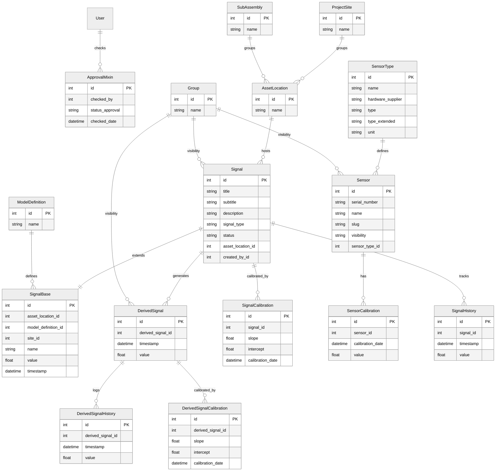

# Repository Analysis & Refactoring: `owi-metadatabase-shm-sdk`

Consider that the legacy folder has to disappear from the code.

In the end, the owi-metadatabase-shm-sdk needs to implement code to GET/POST the following:

* SensorType
* Sensor
* SensorCalibration
* Signal (and DerivedSignal)
* SignalHistory (and DerivedSignalHistory)
* SignalCalibration (and DerivedSignalCalibration)

Load the following skills first so the planning work follows the repo’s Python, Zensical, and documentation authoring guidance.

Study the ERD and understand it to create the necessary code, documentation and testing.

Use the architecture in owi-metadatabase-results (protocols/services/pydantic models/registry/serializers).

Read skill [python](~/.copilot/skills/python/SKILL.md?vscodeLinkType%3Dskill)

Read skill [zensical-customizer](~/.copilot/skills/zensical-customizer/SKILL.md?vscodeLinkType%3Dskill)

Read skill [documentation-writer](~/.copilot/skills/documentation-writer/SKILL.md?vscodeLinkType%3Dskill)

Discovery is back: SHM is still mostly a thin wrapper around archived legacy code, while Results has a fairly explicit domain stack that can be used as the target shape. I’m reading the detailed reports now and then I’ll resolve the remaining ambiguities into an executable refactor plan.

The current SHM client already has the endpoint catalog and transport helpers, but the broader repo plan still assumes a larger replacement of legacy payload-building and user-facing docs. I’m checking the remaining SHM and Results modules that matter for the target package shape, then I’ll pin down the plan boundaries with a couple of specific questions.

**Plan**

Refactor SHM into a results-style typed entity layer. owi-metadatabase-shm-sdk/src/owi/metadatabase/shm/io.py stays the low-level HTTP/auth boundary, and the new architecture adds protocols, Pydantic models, serializers, a registry, and services above it. Delivery should be phased: stabilize the entity/API and upload migration first, then refresh docs and notebooks. The end state removes both owi-metadatabase-shm-sdk/src/owi/metadatabase/shm/legacy and owi-metadatabase-shm-sdk/archive.

1. Freeze the target contract for `SensorType`, `Sensor`, `SensorCalibration`, `Signal`, `DerivedSignal`, `SignalHistory`, `DerivedSignalHistory`, `SignalCalibration`, and `DerivedSignalCalibration`. Use the ERD, owi-metadatabase-shm-sdk/src/owi/metadatabase/shm/io.py, owi-metadatabase-shm-sdk/src/owi/metadatabase/shm/legacy/payloads.py, archive notebooks, and data to define required fields, filters, file uploads, and expected list/get/create behavior. This is the dependency for everything else.
2. Introduce the results-style domain layer under owi-metadatabase-shm-sdk/src/owi/metadatabase/shm, using owi-metadatabase-results-sdk/src/owi/metadatabase/results/protocols.py, owi-metadatabase-results-sdk/src/owi/metadatabase/results/models.py, owi-metadatabase-results-sdk/src/owi/metadatabase/results/serializers.py, owi-metadatabase-results-sdk/src/owi/metadatabase/results/registry.py, and owi-metadatabase-results-sdk/src/owi/metadatabase/results/services/core.py as the template. Adapt the pattern to SHM resources by registering entities rather than analyses.
3. Expand owi-metadatabase-shm-sdk/src/owi/metadatabase/shm/io.py so every in-scope resource has the required GET/POST coverage, plus list support for the history/calibration/derived resources that are still missing. Keep the existing parent-SDK response shape intact.
4. Refactor upload orchestration to consume typed services and serializers instead of legacy payload builders. The main touchpoints are owi-metadatabase-shm-sdk/src/owi/metadatabase/shm/upload/protocols.py, owi-metadatabase-shm-sdk/src/owi/metadatabase/shm/upload/models.py, owi-metadatabase-shm-sdk/src/owi/metadatabase/shm/upload/sensors.py, owi-metadatabase-shm-sdk/src/owi/metadatabase/shm/upload/signals.py, and owi-metadatabase-shm-sdk/src/owi/metadatabase/shm/lookup.py. Only keep behavior from `legacy/` that is still needed, and rehome it into non-legacy modules.
5. Add results-style coverage for the new layers: extend owi-metadatabase-shm-sdk/tests/shm/test_io.py, rework owi-metadatabase-shm-sdk/tests/shm/test_sensor_uploader.py and owi-metadatabase-shm-sdk/tests/shm/test_uploader.py, and add dedicated model/serializer/registry/service tests under owi-metadatabase-shm-sdk/tests/shm. Deletion of legacy code should be gated on parity coverage, not on file-by-file porting.
6. Refresh docs and notebooks after the API surface stabilizes. Update owi-metadatabase-shm-sdk/README.md, owi-metadatabase-shm-sdk/docs/reference/api, owi-metadatabase-shm-sdk/docs/explanation/architecture.md, and owi-metadatabase-shm-sdk/zensical.toml to describe the new typed architecture and remove legacy pages. Then add a new root `notebooks/` suite, using the results notebook structure as the presentation template, and only after those pass remove owi-metadatabase-shm-sdk/archive completely.

**Key Decisions**

The plan assumes phased delivery, because the API and upload refactor are the riskiest part and need to settle before documentation and notebooks are rebuilt. It also assumes the final cleanup removes both runtime legacy code and repository-level archive references. For the architecture itself, the recommended split is two domain services, `sensors` and `signals`, rather than one monolithic SHM service.

**Verification**

1. Run `uv sync --all-packages --all-extras --all-groups` before any tests or notebook execution.
2. Use focused checks during implementation: transport first, then models/serializers/services, then upload workflows.
3. Run `uv run invoke qa` after each major phase.
4. Run `uv run invoke test` before deleting either the legacy package or the archive directory.
5. Run `uv run invoke docs.build` after the docs/nav rewrite.
6. Execute both new notebooks with `uv run jupyter nbconvert --to notebook --execute ...` as the final gate.



You are building the `owi-metadatabase-shm-sdk` repository — an SDK that handles a specialized subset of metadata from the `owi-metadatabase` parent package, to store signal ans sensor metadata, required to build configuration files that we use to convert raw measurements into engineering units. The SDK is designed to be used by other internal packages, but also to be easily consumable by external users who want to interact with the `owi-metadatabase-shm` ecosystem.

> **Tooling requirement:**
    * Use `uv` for all Python environment management, dependency installation, script execution, and package operations throughout every phase of this task. Never use `pip`, `poetry`, `conda`, or any other package manager directly. Read the Python SKILLS document for more details on this requirement.
    * Use the Diátaxis documentation expert SKILL to produce clear, well-structured documentation for the refactored package. This includes docstrings, README, docs folder, and any additional documentation files. The documentation should be comprehensive enough to guide a new user through understanding and using the SDK effectively.
    * Use the zensical customizer skill to ensure that documentation is built with zensical.

---

## Phase 1 - Functional analysis of `owi-metadatabase-shm-sdk/archive/owimetadatabase_shm`

Perform a detailed functional analysis of the files inside the `owimetadatabase_shm` folder. This is the old package and it is important to understand the specific capabilities it provides, and how the new package owi-metadatabase-shm-sdk improves on it. The owi-metadatabase-shm package will completely replace the old one, so it is crucial to understand the specific functionalities it provides, and how the new package owi-metadatabase-shm-sdk improves on it. For each file, document:

- **Core functionality** — What specific tasks does this module perform? How does it process data, and what outputs does it produce?
- **Strengths & weaknesses** — What does this module do well, and where are the potential areas for improvement? Consider factors such as code clarity, modularity, and testability.
- **Fit within the overall architecture** — How does the new implementation of this module (owi-metadatabase-shm) fit into the larger structure of the SDK (owi-metadatabase-sdk)? How should owi-metadatabase-shm be refactored to align with the design patterns and architectural principles identified in Phase 1?

## Phase 2 — Deep Structural and Functional Analysis of `owi-metadatabase-shm-sdk`

Study the full `owi-metadatabase-shm-sdk` repository in detail. This architectural and design pattern analysis shall be your foundation for all subsequent phases. Produce a rigorous, senior-engineer-level assessment covering:

- **Architecture & design patterns** — How is the codebase structured? What paradigms does it follow (OOP, functional, dataclass-driven, etc.)? Are these choices coherent and intentional?
- **Core functionality** — What does this SDK actually *do*? Trace the data flow from ingestion to output. Identify the key abstractions and how they compose.
- **Strengths** — What is done well? Consider API ergonomics, separation of concerns, extensibility, and documentation quality.
- **Weaknesses & technical debt** — Where does the design break down? Flag tight coupling, unclear interfaces, missing abstractions, or anything that would hinder a new contributor.
- **Fit within the parent ecosystem** — How does this SDK relate to `owi-metadatabase` core SDK package? Are the boundaries between them well-defined?
- **Conceptual mistakes** — Identify any fundamental misunderstandings or misapplications of design principles and of behavior w.r.t. archive/owimetadatabase_shm that could be leading to technical debt or maintenance issues.

---

## Phase 3 — Simplified Alternative Architecture and Design Pattern

Design a clean, simple package structure that preserves 100% of the existing functionality of archiveowimetadatabase_shm inside owi-metadatabase-shm-sdk. Your redesign should:

- Reduce unnecessary complexity without sacrificing capability
- Improve discoverability and onboarding for new users
- Respect the constraints of the parent package interface
- Be modular and testable, with clear separation of concerns
- Feature clear docstrings in numpy style. Example:

  ```python
  """
  def tokenize(self, text: str, *args, **kwargs) -> List[str]:
      """Tokenize `text` without splitting multiword token.

     Parameters
      ----------
     text: str
          text that will be tokenized

    Returns
      -------
      list of str
          list of all tokens in the text

      Examples
      --------
      >>> from aksara import BaseTokenizer
      >>> tokenizer = BaseTokenizer()
      >>> text = "Biarlah saja seperti itu"   # 'Biarlah' is a multiword token ('Biar' + 'lah')
      >>> tokenizer.tokenize(text)
      ['Biarlah', 'saja', 'seperti', 'itu']
     """
  ```

For each structural decision, explain *why* — not just what changed, but what problem it solves and what tradeoff it makes. Anticipate objections and address them.

Examples of design patterns:

- abstract factory
- factory method
- prototype
- composite
- template method
- structural subtyping (protocol)

---

## Phase 4 — Test Suite (`/tests`)

Design and implement a comprehensive test suite in the `tests/` folder. Use `uv run pytest` to execute all tests. The suite should cover:

- **Unit tests** — Test each public function, class, and method in isolation. Mock external dependencies (e.g. the parent `owi-metadatabase` package) where necessary. Aim for full branch coverage on core logic.
- **Integration tests** — Test the interaction between internal components and, where feasible, against a real or stubbed instance of the parent package interface.
- **Edge cases & regression tests** — Explicitly test boundary conditions, malformed inputs, and any known failure modes identified during Phase 1.
- **Test configuration** — Set up `pyproject.toml` (managed via `uv`) with a `[tool.pytest.ini_options]` section, and include a `conftest.py` for shared fixtures.

For each test, explain what it is guarding against and why that behavior matters. The suite should be strict enough to catch regressions introduced by the refactoring in Phase 2.

---

## Phase 5 - Documentation (`/docs` and README.md)

Produce comprehensive documentation covering:

- **README.md** — A high-level overview of the package, its purpose, installation instructions, and basic usage examples.
- **Home** — An introduction to the SDK, its relationship to the parent package, and its core capabilities.
- **Tutorials** — Step-by-step guides for common use cases, designed to onboard new users.
- **How-to Guides** — Focused instructions for specific tasks or workflows.
- **Reference** — Detailed API documentation for all public interfaces, generated from docstrings.
- **Explanation** — In-depth explanations of the design decisions, architectural patterns, and any non-obvious implementation details.
- **Development** — Guidelines for contributing to the package, including coding standards, testing requirements, and the refactoring process.
- **About** — Information about the maintainers, changelog, license, and how to get support.

## Phase 6 — Implementation Roadmap

Provide a concrete, sequenced migration plan. Each step should be independently executable and leave the package in a working state. Include dependency order, risk areas, and backward-compatibility considerations. All dependency changes at each step must be applied using `uv add` / `uv remove`, and all code execution must go through `uv run`.

---

## Phase 7 — Notebook Suite (`/notebooks`)

Implement the two Jupyter Notebooks in the `notebooks/` folder to upload sensors and signals by adopting the new SDK. These notebooks should perform the same functionalities of the notebooks available in archive/notebooks, but using the new SDK. The notebooks should be runnable top-to-bottom without errors, and should serve as both documentation and functional tests for the new package. Use `uv add --dev` to install Jupyter and all required dependencies. The data imported by the archive notebooks is available in the scripts/data/folder. Just be mindful that some file names have been changed to increase clarity, so you will need to update the notebook code accordingly.

The two notebooks together should provide full coverage of the package's features. Install Jupyter and all required dependencies using `uv sync --all-packages --all-extras --all-groups`. Each notebook should:

- Be self-contained and runnable top-to-bottom via `uv run jupyter nbconvert --to notebook --execute`
- Demonstrate a specific capability or workflow
- Serve as both documentation and a functional test

Design the notebook suite so it could double as an interactive tutorial for a new user unfamiliar with the SDK. Use the structure in /home/pietro.dantuono@24SEA.local/Projects/SMARTLIFE/OWI-metadatabase-SDK/owi-metadatabase-results-sdk/scripts/1.0.lifetime-design-frequencies.ipynb as a reference for how to structure the notebooks, and make sure to include clear explanations, code comments, and output visualizations where appropriate.

---

Find here below the mermaid entity-relationship diagram of the current `owi-metadatabase-shm` data model, which should be used as a reference for the refactoring plan. You can find a more detail data-model of the core `owi-metadatabase` package in the `docs/` folder of the `owi-metadatabase-sdk` namespace repository package.
