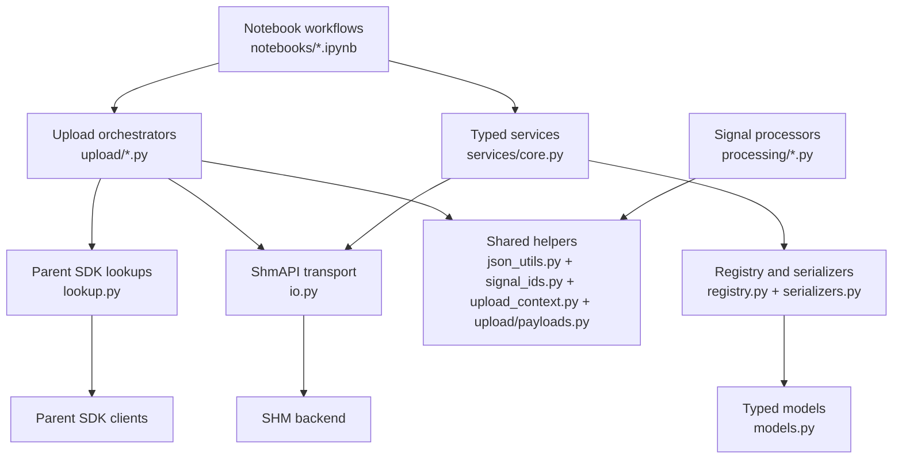

# Architecture

The SHM SDK is organized around a clear split between **transport**, a typed
**entity layer**, **processing**, and **upload orchestration**. The goal is to
keep HTTP details, normalization rules, and workflow logic separate so the same
public surface works for direct API queries, upload automation, notebooks, and
tests.

## Package Layout

```
owi.metadatabase.shm
├── io.py                 # ShmAPI transport client
├── models.py             # Typed SHM entity and query models
├── serializers.py        # DataFrame / backend normalization helpers
├── registry.py           # Entity registration metadata
├── services/             # Repository-backed sensor and signal services
├── lookup.py             # Parent SDK lookup service
├── processing/           # Signal config parsing & processing
├── upload/               # Upload request models and orchestrators
├── json_utils.py         # JSON loading helpers
├── signal_ids.py         # Signal identifier parsing
└── upload_context.py     # Shared upload context dataclass
```

## Layered View



## Transport Boundary

`ShmAPI` owns the HTTP seam. Endpoint names are centralized there, and all
network behavior remains behind the parent-sdk-style response contract:
`{"data": ..., "exists": ..., "id": ...}`.

That separation matters for two reasons:

1. The rest of the package can stay focused on SHM semantics instead of request
     formatting.
2. Tests and notebooks can replace the transport with deterministic stubs
     without rewriting workflow logic.

## Typed Entity Layer

The typed layer mirrors the shape used in the results SDK:

- `models.py` defines Pydantic records and query objects.
- `serializers.py` converts backend rows into typed records.
- `registry.py` declares which entity maps to which serializer and repository
    methods.
- `services/core.py` exposes repository-backed workflows such as
    `SensorService` and `SignalService`.

This layer gives the package a stable domain vocabulary above raw DataFrames
and loosely typed backend dictionaries.

## Processing Pipeline

The `processing/` package converts raw turbine configuration events into
archive-compatible signal mappings that the upload layer can consume.

The pipeline is intentionally explicit:

1. Discover input files.
2. Parse signal keys.
3. Apply derived-signal strategies.
4. Accumulate typed in-memory records.
5. Export normalized upload-ready mappings.

The important design choice is that farm-specific behavior is configured
through processor specs and strategies rather than being hard-coded into one
monolithic importer.

## Upload Workflows

The `upload/` package provides two orchestrators:

- `ShmSensorUploader` for sensor types, sensors, and sensor calibrations.
- `ShmSignalUploader` for signals, derived signals, histories, and
    calibrations.

Both orchestrators depend on protocols and shared helper modules instead of a
legacy compatibility package. This keeps the workflow code small, testable, and
usable from notebooks.

## Shared Helper Modules

The helper modules that used to live under a dedicated legacy package now have
stable homes in the public package:

- `json_utils.py` for file-backed JSON loading.
- `signal_ids.py` for signal identifier parsing.
- `upload_context.py` for resolved upload context objects.
- `upload/payloads.py` for payload construction helpers.

They still preserve the archive-compatible payload shapes required by existing
data, but they no longer force users through a separate mental model.

## Notebook Role

The root `notebooks/` suite sits on top of the typed package surface. The
notebooks are designed to do two jobs at once:

- act as interactive tutorials for new users;
- act as executable regression checks for the public workflows.

That is why the notebooks use bundled example data and deterministic clients
instead of depending on a live backend.

## Design Decisions

| Decision | Why it exists |
|---|---|
| Results-style typed layer | Keeps SHM aligned with the rest of the extension ecosystem and reduces ad-hoc backend dict handling |
| Protocol-based upload dependencies | Makes orchestrators easy to test and notebook-friendly |
| Processing and upload split | Parsing raw config files and mutating backend records are different responsibilities |
| Stable helper modules | Preserves archive-compatible payload logic without keeping a separate legacy package alive |
| Executable notebook suite | Gives users a guided workflow and gives maintainers a reproducible end-to-end check |
