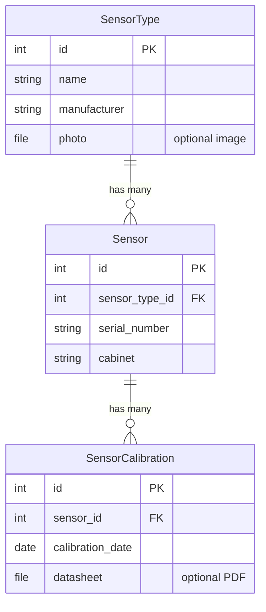

# Sensor Data Model

The SHM backend organizes physical sensor metadata into a three-level
hierarchy: **Sensor Type** → **Sensor** → **Sensor Calibration**.

## Entity Hierarchy

## Sensor Types

A **sensor type** represents a product model (e.g. "PCB 393B04
accelerometer"). Each sensor type has a unique `name` and `manufacturer`, and
can carry an optional photo file.

The SDK uploads sensor types via
[`ShmSensorUploader.upload_sensor_types()`][owi.metadatabase.shm.upload.sensors.ShmSensorUploader.upload_sensor_types].

## Sensors

A **sensor** is one physical device identified by its `serial_number` and
`cabinet` (installation location). Every sensor belongs to exactly one sensor
type.

The SDK uploads sensors via
[`ShmSensorUploader.upload_sensors()`][owi.metadatabase.shm.upload.sensors.ShmSensorUploader.upload_sensors].

## Sensor Calibrations

A **sensor calibration** records a calibration event for a specific sensor.
Each calibration carries a `calibration_date` and an optional PDF datasheet
file.

The SDK uploads sensor calibrations via
[`ShmSensorUploader.upload_sensor_calibrations()`][owi.metadatabase.shm.upload.sensors.ShmSensorUploader.upload_sensor_calibrations].

## Upload Workflow

The three entity types are uploaded in dependency order:

1. **Sensor types** first — so that sensor type IDs exist for sensor creation.
2. **Sensors** next — referencing the sensor type by ID.
3. **Sensor calibrations** last — referencing the sensor by ID.

See the [Upload Sensor Types](../how-to/upload-sensor-types.md) how-to guide
for a step-by-step recipe.
