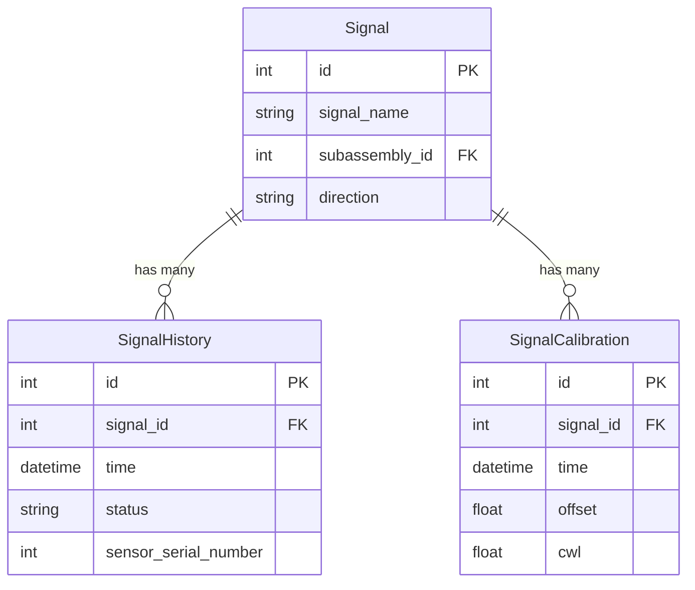
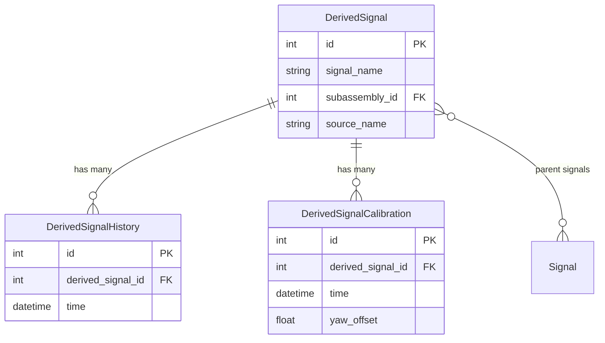

# Signal Data Model

The SHM backend organizes monitoring signal metadata into two parallel
hierarchies: **main signals** and **derived signals**.

## Main Signal Hierarchy

## Derived Signal Hierarchy

## Processing Pipeline

Raw configuration events (JSON arrays) are transformed into typed records by
the [processing subpackage](../reference/api/processing.md):

1. **Parse** — `DelimitedSignalKeyParser` extracts signal name and property
   from keys like `"NRT_WTG_TP_STRAIN/status"`.
2. **Accumulate** — `ProcessedSignalRecord` and `ProcessedDerivedSignalRecord`
   collect status, offset, CWL, and calibration rows.
3. **Convert** — `SignalProcessingResult.to_legacy_data()` produces the
   archive-compatible dict shape consumed by the upload layer.

## Upload Workflow

The signal upload orchestrator (`ShmSignalUploader`) follows this sequence:

1. **Create main signals** — one per signal name, returns backend IDs.
2. **Create signal histories** — status rows per signal.
3. **Create signal calibrations** — offset/CWL rows per signal.
4. **Create derived signals** — one per derived signal name.
5. **Create derived signal histories** — with parent signal patches.
6. **Create derived signal calibrations** — calibration rows per derived signal.

See the [Process Signal Configs](../how-to/process-signal-configs.md) how-to
guide for a step-by-step recipe.
