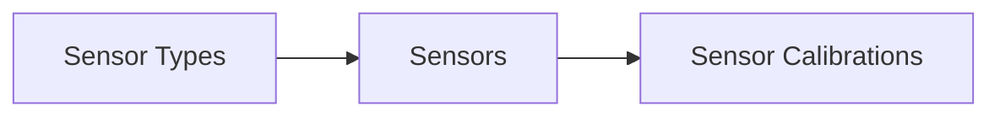

# Upload Sensors Tutorial

!!! example
    This tutorial walks you through the complete sensor upload workflow:
    sensor types, sensors, and sensor calibrations.

## Prerequisites

- Python 3.10+
- The SDK installed (`pip install owi-metadatabase-shm`)
- A valid API token
- Sensor data files (types, sensors, calibrations) and optional images/PDFs

## Overview

The sensor upload workflow follows the SHM data model hierarchy:



Each step depends on IDs created in the previous step.

## Step 1 — Set Up the API Client

```python
from owi.metadatabase.shm import ShmAPI, ShmSensorUploader

api = ShmAPI(
    api_root="https://owimetadatabase.azurewebsites.net/api/v1",
    token="your-api-token",
)

uploader = ShmSensorUploader(shm_api=api)
```

## Step 2 — Upload Sensor Types

Load your sensor type definitions and upload them:

```python
from owi.metadatabase.shm import load_json_data

sensor_types = load_json_data("data/sensors/sensor_types.json")

type_results = uploader.upload_sensor_types(
    sensor_types_data=sensor_types,
    permission_group_ids=[1, 2],
    path_to_images="data/sensors/img/",
)

print(f"Created {len(type_results)} sensor types")
```

## Step 3 — Upload Sensors by Category

For each sensor category (accelerometers, strain gages, etc.), resolve the
sensor type and upload all per-turbine sensors:

```python
from owi.metadatabase.shm import load_json_data

sensors = load_json_data("data/sensors/sensors.json")

# Upload accelerometers
acc_results = uploader.upload_sensors(
    sensor_type_name="accelerometers",
    sensor_type_params={"name": "393B04"},
    sensors_data=sensors,
    permission_group_ids=[1, 2],
)

# Upload strain gages
strain_results = uploader.upload_sensors(
    sensor_type_name="strain_gages",
    sensor_type_params={"name": "CEA-Series"},
    sensors_data=sensors,
    permission_group_ids=[1, 2],
)
```

## Step 4 — Upload Sensor Calibrations

Load your signal-sensor and signal-calibration maps, then upload
calibrations with PDF datasheets:

```python
from owi.metadatabase.shm import load_json_data

signal_sensor_map = load_json_data("data/sensors/signal_sensor_map.json")
signal_calibration_map = load_json_data("data/sensors/signal_calibration_map.json")

cal_results = uploader.upload_sensor_calibrations(
    signal_sensor_map_data=signal_sensor_map,
    signal_calibration_map_data=signal_calibration_map,
    path_to_datasheets="data/sensors/datasheets/",
)

print(f"Created {len(cal_results)} calibrations")
```

## What You Learned

- How to set up `ShmSensorUploader` with protocol-based dependency injection.
- How to upload sensor types with optional image attachments.
- How to upload sensors grouped by category across turbines.
- How to upload sensor calibrations with optional PDF attachments.

## Next Steps

- [Upload Signals Tutorial](upload-signals.md) — the signal upload workflow
- [Sensor Data Model](../explanation/sensor-data-model.md) — understand the entity hierarchy
- [How-to: Upload Sensor Types](../how-to/upload-sensor-types.md) — focused recipe
