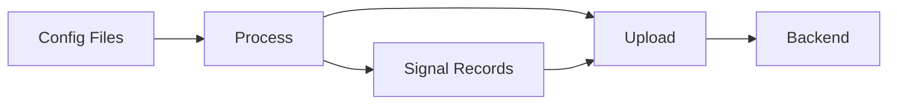

# Upload Signals Tutorial

!!! example
    This tutorial walks you through the complete signal upload workflow:
    processing configuration files and uploading signals to the backend.

## Prerequisites

- Python 3.10+
- The SDK installed with all dependencies
- A valid API token
- JSON signal configuration files (one per turbine)
- Access to the parent SDK (`owi-metadatabase`) for location and geometry
  lookups

## Overview

The signal upload workflow has two phases:



## Step 1 — Process Signal Configurations

```python
from owi.metadatabase.shm import DefaultSignalConfigProcessor

processor = DefaultSignalConfigProcessor(
    path_configs="data/Norther/signal_configs/",
)
processor.signals_process_data()

print(f"Discovered turbines: {processor.turbines}")
print(f"Signals per turbine: {
    {t: len(s) for t, s in processor.signals_data.items()}
}")
```

## Step 2 — Set Up the Signal Uploader

The signal uploader needs the SHM transport client and parent SDK clients
for resolving project sites, asset locations, and subassemblies:

```python
from owi.metadatabase import LocationsAPI, GeometryAPI
from owi.metadatabase.shm import ShmAPI, ShmSignalUploader

shm_api = ShmAPI(
    api_root="https://owimetadatabase.azurewebsites.net/api/v1",
    token="your-api-token",
)
locations_api = LocationsAPI(
    api_root="https://owimetadatabase.azurewebsites.net/api/v1",
    token="your-api-token",
)
geometry_api = GeometryAPI(
    api_root="https://owimetadatabase.azurewebsites.net/api/v1",
    token="your-api-token",
)

uploader = ShmSignalUploader.from_clients(
    shm_api=shm_api,
    locations_client=locations_api,
    geometry_client=geometry_api,
)
```

## Step 3 — Upload from Processor

The highest-level method processes configs and uploads in one call:

```python
results = uploader.upload_from_processor(
    projectsite="Norther",
    processor=processor,
    permission_group_ids=[1, 2],
)

for turbine, result in results.items():
    print(f"{turbine}: {len(result.signal_ids_by_name)} signals, "
          f"{len(result.derived_signal_ids_by_name)} derived signals")
```

## Step 4 — Upload with Sensor Maps (Optional)

If you have sensor-serial-number mappings and temperature compensation maps:

```python
results = uploader.upload_from_processor_files(
    projectsite="Norther",
    processor=processor,
    path_signal_sensor_map="data/Norther/signal_sensor_map.json",
    path_sensor_tc_map="data/Norther/sensor_tc_map.json",
    permission_group_ids=[1, 2],
)
```

## What You Learned

- How to process signal configurations with `DefaultSignalConfigProcessor`.
- How to wire `ShmSignalUploader` with parent SDK clients.
- How to upload signals from processed configs in one call.
- How to include sensor serial numbers and temperature compensation maps.

## Next Steps

- [Upload Sensors Tutorial](upload-sensors.md) — the sensor upload workflow
- [Signal Data Model](../explanation/signal-data-model.md) — understand signal entities
- [How-to: Process Signal Configs](../how-to/process-signal-configs.md) — focused recipe
